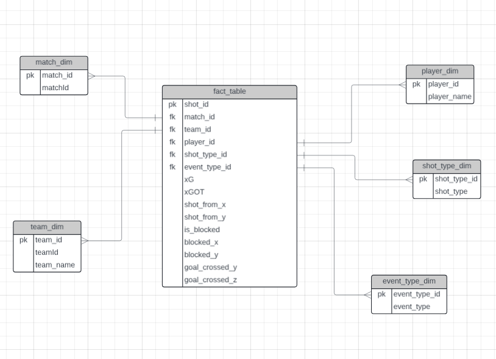
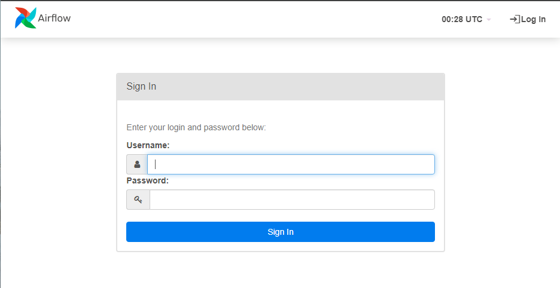
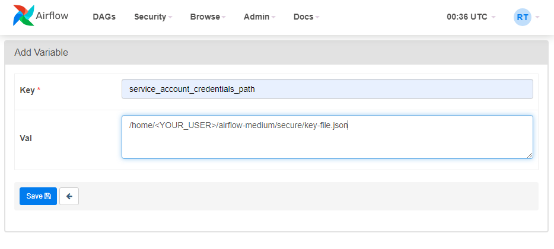
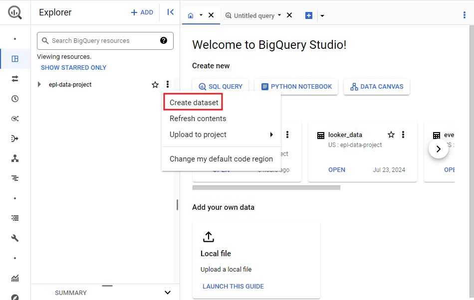
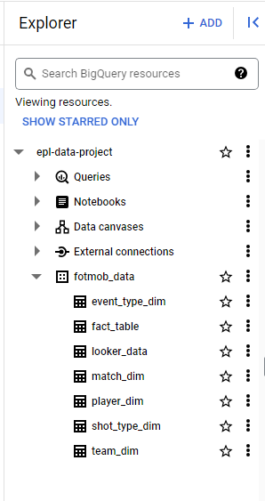
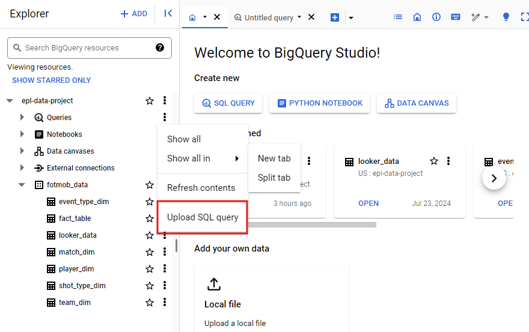
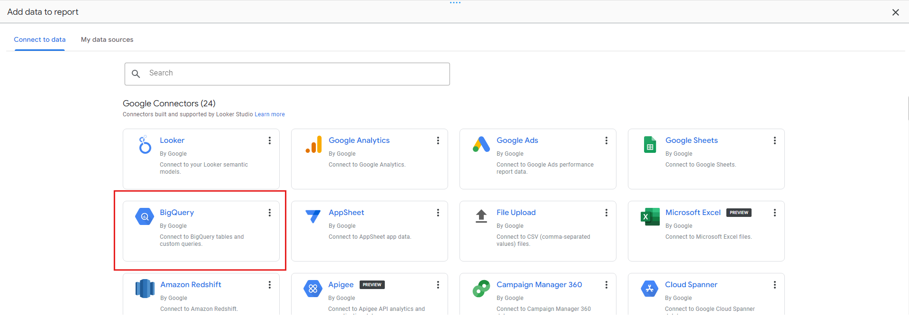
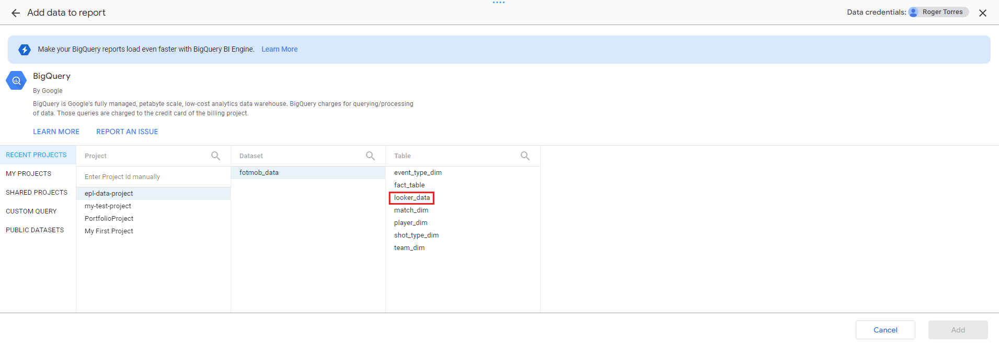

# Fotmob Data Pipeline

## Introduction

This project demonstrates a data pipeline designed to transport shot data from the 2023/2024 Premier League season into a dashboard, where players and teams can be compared using key metrics such as xG (expected goals), xGOT (expected goals on target) and SGA (shooting goals added).

Using Airflow, this pipeline orchestrates Python scripts, which use Selenium to scrape detailed match data from the Fotmob website, process the data (using Pandas) into a dimensional model with a fact table representing individual shots taken during games, and load data into BigQuery. A SQL query organizes the data into a structured format that can be accessed from Looker to create a dashboard.

This guide will walk you through how to reproduce this pipeline and connect the resulting data to Looker to create your own dashboard.

## Data Model

The Fotmob data is transformed into a dimensional model, with a fact table consisting of individual shots and multiple dimension tables representing different dimensions associated with each shot (e.g. player, team, shot type, etc.).



## Tools and Technologies
* Python
    * Selenium
    * Pandas
* Apache Airflow
* Google Cloud Platform 
    * Cloud Storage
    * Compute Engine
    * BigQuery
* Looker

## Steps

#### Requirements
* Google account
* Google Cloud Platform account (or free trial)

#### Clone the repository to your computer

```
git clone https://github.com/torresroger776/FotmobDataPipeline.git
```

#### Set up Airflow on Google Cloud Computer Engine
Follow the instructions at https://medium.com/apache-airflow/a-simple-guide-to-start-using-apache-airflow-2-on-google-cloud-1811c2127445 to set up the Airflow instance.

*Note 1: Give your service account the ```BigQuery Admin``` role rather than the ```BigQuery Job User``` role.*

*Note 2: Name the Cloud Storage bucket ```fotmob-airflow``` for consistency.*

#### Upload the ```fotmob-dag.py``` file to Cloud Storage

Create a folder named ```dags``` and upload the DAG file to it.


#### SSH into your Compute Engine instance


#### Run the Airflow server
If you haven't started the Airflow web server and scheduler already, run the script ```airflow-start.sh``` that you saved by following the steps in the article linked above.

```
. airflow-start.sh
```

Then, access the Airflow UI at ```https://<COMPUTE_ENGINE_EXTERNAL_IP>:8080```.



*Note: You may need to run ```sed -i 's/\r$//' airflow-start.sh``` to remove carriage returns from the file, which may cause the script to fail.*

#### Move the ```fotmob-dag.py``` file to your Compute Engine instance
First, make a new directory in your ```airflow-medium``` folder called ```dags```.

```
cd /home/<YOUR_USER>/airflow-medium/
mkdir dags
```

Then, copy the DAG file from Cloud Storage to your ```airflow-medium``` folder.

```
gsutil cp gs://fotmob-airflow/dags/* /home/<YOUR_USER>/airflow-medium/dags/
```

#### Install the required Python libraries

```
pip install selenium
pip install webdriver-manager
pip install google-cloud
pip install pandas-gbq
```

#### Install Chromium browser for Selenium to work

```
sudo apt-get install -y chromium
```

#### Create an environment variable for your service account's credentials file path

Run the following command to create the environment variable in your compute instance.

```
export AIRFLOW_VAR_SERVICE_ACCOUNT_CREDENTIALS_PATH=/home/<YOUR_USER>/airflow-medium/secure/key-file.json
```

Then, on the Airflow UI, navigate to Admin > Variables, and click the + sign to add a new variable, with key ```service_account_credentials_path``` and value ```/home/<YOUR_USER>/airflow-medium/secure/key-file.json```.



#### Create BigQuery dataset

Before we run our Airflow DAG, we need to create a dataset on BigQuery where the tables will populate.

On the main BigQuery menu, click the three dots next to your project name and choose ```Create dataset```.



Enter ```fotmob_data``` for the dataset ID and create the dataset.

#### Run the DAG

On the Airflow UI, find the ```fotmob_dag``` in the active DAGs list and click the play button to trigger the DAG.


The DAG will take several minutes to complete. Once it has run successfully, you will find the resulting tables in your ```fotmob_data``` dataset on BigQuery.



#### Create Looker table for exporting

Find the Queries section in the BigQuery Explorer, click the three dots, and select ```Upload SQL query```.



Select the SQL file ```create_looker_data_table.sql``` in the sql folder of the repository. Specify a name for ```SQL name``` and click ```Upload```.

Now run the query to create (or replace) the new table ```looker_data```, which we will link to Looker.

#### Create Looker dashboard

Navigate to Looker Studio with your Google account and create a ```Blank Report```.

You will be directed to connect your data to the report. Choose the ```BigQuery``` connector, and find the ```looker_data``` table. Click ```Add```.





Now, you can create a dashboard using the Fotmob data we have loaded from BigQuery. As an example, here is the dashboard I made following this same process https://lookerstudio.google.com/s/lndZU1PI9dI.


### Next Steps

This project can be extended in a few different ways: 

* Running the DAG on a schedule and automatically processing batches of game data as the current Premier League season progresses
* Adding more fields to the dimension tables to allow for more reporting capabilities and more extensive filtering
* Transferring data between tasks using remote storage, like Google Cloud Storage, rather than XCom
